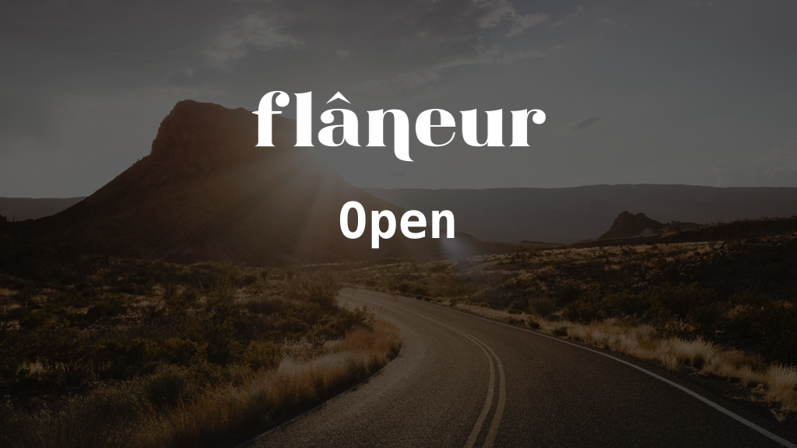

# FlaneurOpen

[](https://travis-ci.org/dirtyhenry/FlaneurOpen)
[](http://cocoapods.org/pods/FlaneurOpen)
[](http://cocoapods.org/pods/FlaneurOpen)
[](http://cocoapods.org/pods/FlaneurOpen)

## Example

To run the example project, clone the repo, and run `pod install` from the Example directory first.

## Requirements

### Google Maps API Key

This application requires a Google Maps API Key. It will be read from a file at
`Example/FlaneurOpenSecretInfo.plist`. For security reasons, this file does not
exist in this repository. To create it, please set your API Key as `GOOGLE_PLACES_FLANEUR_API_KEY`
in your environment variables and run the script `./createAPIKeysPlist.sh` from
the `Example` directory.

## Installation

FlaneurOpen is available through [CocoaPods](http://cocoapods.org). To install
it, simply add the following line to your Podfile:

```ruby
pod "FlaneurOpen"
```

## Author

Flâneur.

## License

FlaneurOpen is available under the MIT license. See the LICENSE file for more info.

## Credits

[Icons from Glyphish](http://www.glyphish.com).

<a style="background-color:black;color:white;text-decoration:none;padding:4px 6px;font-family:-apple-system, BlinkMacSystemFont, &quot;San Francisco&quot;, &quot;Helvetica Neue&quot;, Helvetica, Ubuntu, Roboto, Noto, &quot;Segoe UI&quot;, Arial, sans-serif;font-size:12px;font-weight:bold;line-height:1.2;display:inline-block;border-radius:3px;" href="https://unsplash.com/@hellocolor?utm_medium=referral&amp;utm_campaign=photographer-credit&amp;utm_content=creditBadge" target="_blank" rel="noopener noreferrer" title="Download free do whatever you want high-resolution photos from Pawel Nolbert"><span style="display:inline-block;padding:2px 3px;"><svg xmlns="http://www.w3.org/2000/svg" style="height:12px;width:auto;position:relative;vertical-align:middle;top:-1px;fill:white;" viewBox="0 0 32 32"><title></title><path d="M20.8 18.1c0 2.7-2.2 4.8-4.8 4.8s-4.8-2.1-4.8-4.8c0-2.7 2.2-4.8 4.8-4.8 2.7.1 4.8 2.2 4.8 4.8zm11.2-7.4v14.9c0 2.3-1.9 4.3-4.3 4.3h-23.4c-2.4 0-4.3-1.9-4.3-4.3v-15c0-2.3 1.9-4.3 4.3-4.3h3.7l.8-2.3c.4-1.1 1.7-2 2.9-2h8.6c1.2 0 2.5.9 2.9 2l.8 2.4h3.7c2.4 0 4.3 1.9 4.3 4.3zm-8.6 7.5c0-4.1-3.3-7.5-7.5-7.5-4.1 0-7.5 3.4-7.5 7.5s3.3 7.5 7.5 7.5c4.2-.1 7.5-3.4 7.5-7.5z"></path></svg></span><span style="display:inline-block;padding:2px 3px;">Pawel Nolbert</span></a>
